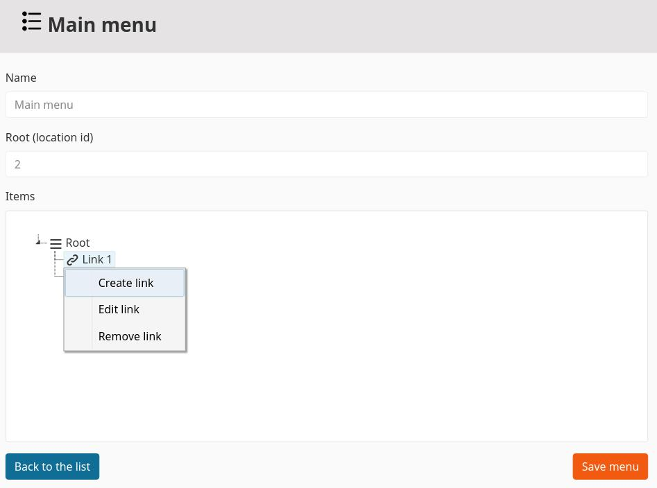
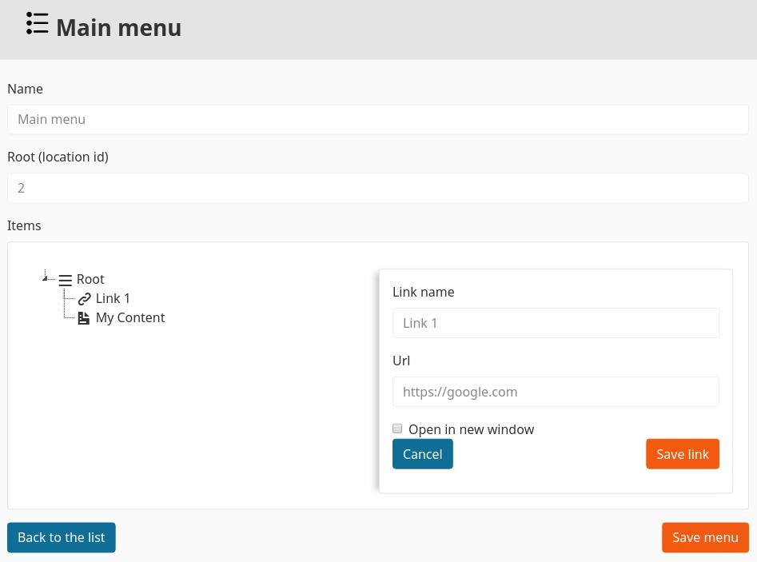
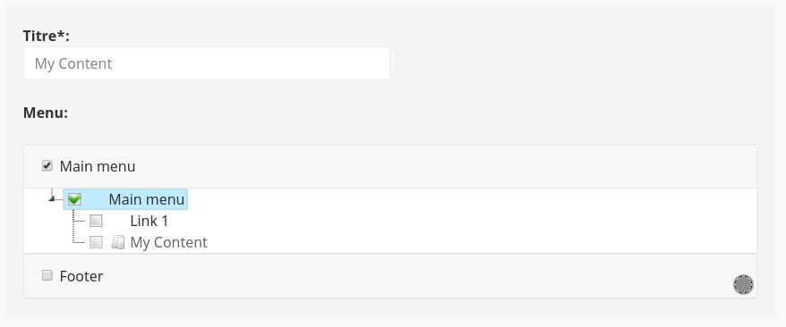

# Novactive eZ Menu Manager Bundle

[](https://travis-ci.org/Novactive/NovaeZMenuManagerBundle)
[](https://github.com/Novactive/NovaeZMenuManagerBundle/releases)

An eZPlatform bundle to let your contributor manage their website menus.
 
## Features

- Admin interface to create/edit/remove a menu
- Manage and organize links from menu edit interface
- Add an ezpublish content to a menu when publishing a content

## Requirements

- eZ Platform Admin UI
- PHP 7.1+
- Webpack Encore

## Installation

### Use Composer

Add NovaeZMenuManagerBundle in your composer.json:

```bash
composer require novactive/ezmenumanagerbundle
```

### Register the bundle

Register the bundle in your application's kernel class:

```php
// app/AppKernel.php
public function registerBundles()
{
    $bundles = array(
        // ...
        new Novactive\EzMenuManagerBundle\EzMenuManagerBundle(),
        // ...
    );
}
```

### Routing config

Add the following routing config

```php
novactive.menu_manager:
    resource: "@EzMenuManagerBundle/Controller/"
    type:     annotation
    prefix:   /
```

### Define menu types

Menu types are defined thougth the following siteaccess aware variable
```yaml
nova_menu_manager.default.menu_types:
    <identifier>: <string or translation key>
```

Exemple 
```yaml
nova_menu_manager.default.menu_types:
    main: menu.type.main
    footer: menu.type.footer
```

## Usage

First create a new menu in the "Menu manager" interface


While editing a menu, you will be able to define the following properties :
* __name__: Name of the menu
* __root (location id)__: This is used to determine the menus availables when publishing a content
* __items__: This is where you can drag&drop, remove, edit and create the menu's links 





Once a menu has been created, you can add the "Menu item" fieldtype to the content types you want to be able to add links to the menus.

Then when publishing a content having the "Menu item" fieldtype, you can select in which menu you want to add a link to the content.



